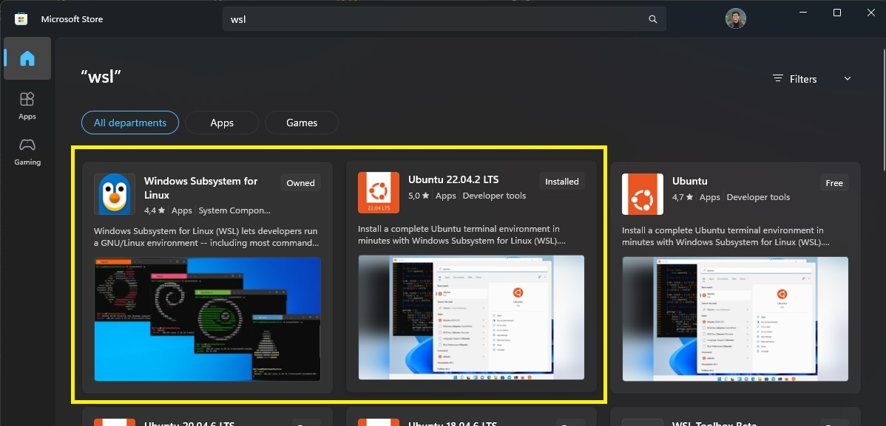

# digital-skola-project-3-batch-processing

## Objective: 
Create a basic batch processing routine that inserts data from a.csv file into a postgresql database.

## Prerequisite:
- Docker
- Python3

## Procedure:
This project makes use of Docker using Windows Subsystem for Linux (wsl) rather than Docker Desktop Windows.

1. Install WSL & Linux via Microsoft Store


2. Install Docker on WSL
```
# update the package manager and install some prerequisites (all of these aren't technically required)
sudo apt-get update
sudo apt-get install -y apt-transport-https ca-certificates curl software-properties-common libssl-dev libffi-dev git wget nano

# create a group named docker and add yourself to it
#   so that we don't have to type sudo docker every time
#   note you will need to logout and login before this takes affect (which we do later)
sudo groupadd docker
sudo usermod -aG docker ${USER}

# add Docker key and repo
curl -fsSL https://download.docker.com/linux/ubuntu/gpg | sudo apt-key add -
sudo add-apt-repository "deb [arch=amd64] https://download.docker.com/linux/ubuntu $(lsb_release -cs) stable"

# update the package manager with the new repos
sudo apt-get update

# upgrade the distro
sudo apt-get upgrade -y
sudo apt-get autoremove -y

# install docker
sudo apt-get install -y docker-ce containerd.io

# (optional) install latest version of docker compose
sudo curl -sSL https://github.com/docker/compose/releases/download/`curl -s https://github.com/docker/compose/tags | \
grep "compose/releases/tag" | sed -r 's|.*([0-9]+\.[0-9]+\.[0-9]+).*|\1|p' | head -n 1`/docker-compose-`uname -s`-`uname -m` \
-o /usr/local/bin/docker-compose && sudo chmod +x /usr/local/bin/docker-compose

```

3. Install required python package
```
# required if you haven't install pip  
sudo apt install python3-pip 

# install required python package
pip install --no-cache-dir -r requirements.txt

```

4. Build & Run Docker Compose
```
docker compose up --build
```

5. Run script in directory code


## Others

Command to Execute Inside Postgres Container
```
docker exec -it ds-postgresql psql -U postgres
```

If occured "current transaction is aborted"
```
cur.execute("ROLLBACK")
conn.commit()
```


## Reference
- https://dev.to/bartr/install-docker-on-windows-subsystem-for-linux-v2-ubuntu-5dl7